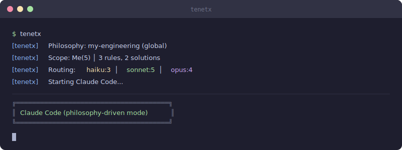

<p align="center">
  
</p>

<p align="center">
  <strong>Declare principles. Generate workflow. Compound growth.</strong>
</p>

<p align="center">
  <a href="https://github.com/wooo-jin/tenetx/actions/workflows/ci.yml"></a>
  <a href="https://www.npmjs.com/package/tenetx"></a>
  <a href="https://opensource.org/licenses/MIT"></a>
  <a href="./coverage/"></a>
</p>

<p align="center">
  <a href="#installation">Install</a> &middot;
  <a href="#philosophy">Philosophy</a> &middot;
  <a href="#usage">Usage</a> &middot;
  <a href="#architecture">Architecture</a> &middot;
  <a href="README.ko.md">한국어</a>
</p>

---

## What is Tenetx?

Tenetx is a **philosophy-driven harness** for [Claude Code](https://docs.anthropic.com/en/docs/claude-code). Instead of tweaking dozens of config files, you declare your engineering principles — and Tenetx generates hooks, model routing, alerts, agents, and skills automatically.

```
$ claude                        $ tenetx
│                                │
│ Default Claude Code            │ Tenetx runs first
│ Generic settings               │  ├── Load philosophy.yaml
│                                │  ├── Resolve scope (Me / Team / Project)
│                                │  ├── Sync knowledge packs
│                                │  ├── Generate hooks & routing
│                                │  └── Launch Claude Code (configured)
│                                │
│ General-purpose tool           │ Your tool
```

**Tenetx does not fork or modify Claude Code.** It configures the settings, hooks, and CLAUDE.md that Claude Code already reads — shaped by your principles.

### Why Tenetx?

- **Philosophy-driven**: Declare beliefs, not configs. Workflows emerge automatically.
- **Growth-oriented**: Compound engineering loop extracts patterns from every session.
- **Team-aware**: Move knowledge (packs) between personal → team → org seamlessly.
- **Production-ready**: 1204 tests (100% pass), 19 agents in 3 lanes, 21 skills, 8 MCP servers, 16-signal model routing.

---

## Installation

### Prerequisites

- **Node.js** >= 18
- **Claude Code** installed and authenticated

### Quick Start

```bash
# Install globally
npm install -g tenetx

# Initial setup — 3 questions, 30 seconds
tenetx setup

# Run Claude Code with your philosophy applied
tenetx
```

### As a Claude Code Plugin

```bash
tenetx install --plugin
```

### What it looks like

<p align="center">
  
</p>

> To record a full GIF demo, install [VHS](https://github.com/charmbracelet/vhs) and run `vhs demo/demo.tape`

---

## Philosophy

The core idea: **you don't configure workflows — you declare beliefs, and workflows emerge.**

### philosophy.yaml

```yaml
name: "my-engineering"
author: "Your Name"

principles:
  understand-before-act:
    belief: "Acting without understanding compounds cost exponentially"
    generates:
      - "Every task follows explore → plan → implement"
      - "On rollback, assess change scope first"
      - hook: "UserPromptSubmit → auto-load relevant manuals"

  decompose-to-control:
    belief: "Large tasks must be decomposed to remain controllable"
    generates:
      - "Break work into PLANS / CONTEXT / CHECKLIST"
      - alert: "Warn when same file edited 5+ times"

  capitalize-on-failure:
    belief: "Repeating the same mistake is a system failure"
    generates:
      - "Extract patterns via compound after every session"
      - "Auto-generate prevention rules from failures"

  focus-resources-on-judgment:
    belief: "Resources should concentrate where judgment is needed"
    generates:
      - routing: "explore → Sonnet, implement → Opus"
      - alert: "Warn when session cost exceeds $10"

  knowledge-comes-to-you:
    belief: "Developers need knowledge at decision points, not in search results"
    generates:
      - "Auto-suggest relevant solutions when editing"
      - "Inject pack knowledge into prompts automatically"
```

Five principles automatically generate hooks, alerts, routing rules, and compound behaviors. No manual configuration required.

---

## Quick Start Paths

### Personal Developer

```bash
tenetx setup                    # Accept defaults
tenetx                          # Run with your philosophy
# End of session
tenetx compound                 # Extract patterns for reuse
```

### Small Team (5-10 people)

```bash
# Team lead
tenetx init --team --yes        # Auto-detect + create .compound/pack.json
git add .compound/ && git commit -m "chore: add tenetx team pack"

# Teammates
git pull && tenetx              # Auto-loads team philosophy

# End of day
tenetx compound                 # Extract insights → auto-classify (personal/team)
tenetx propose                  # Create proposal for team knowledge
tenetx proposals                # Team lead reviews + merges
```

### Large Organization

```bash
# Setup
tenetx init --team --pack-repo org/tenetx-pack-emr --yes
tenetx init --extends           # Or use extends for central management

# Daily
tenetx                          # Auto-pulls + syncs latest team rules
```

---

## Philosophy Templates

Pre-built `philosophy.yaml` starters for common engineering roles. Copy and customize to fit your team.

| Template | Role | Key Principles |
|---|---|---|
| [`templates/philosophy-backend.yaml`](templates/philosophy-backend.yaml) | Backend Engineer | reliability-first, data-integrity, security-by-default, observe-everything |
| [`templates/philosophy-frontend.yaml`](templates/philosophy-frontend.yaml) | Frontend Developer | user-first, accessible-by-default, performance-budget, component-isolation |
| [`templates/philosophy-fullstack.yaml`](templates/philosophy-fullstack.yaml) | Fullstack Developer | contract-driven, end-to-end-ownership, fail-gracefully, iterate-with-feedback |
| [`templates/philosophy-data.yaml`](templates/philosophy-data.yaml) | Data Scientist / Engineer | reproducibility-always, data-quality-first, pipeline-reliability, document-the-why |
| [`templates/philosophy-devops.yaml`](templates/philosophy-devops.yaml) | DevOps / SRE | automate-everything, observability-by-design, minimize-blast-radius, blameless-learning |

```bash
# Use a template as your starting point
cp templates/philosophy-backend.yaml philosophy.yaml
# Edit philosophy.yaml to match your beliefs, then run:
tenetx
```

---

## Usage

### Basic Commands

```bash
tenetx                              # Start with harness applied
tenetx "Refactor the chart API"     # Start with a prompt
tenetx --resume                     # Resume previous session
tenetx --offline                    # Run without network
```

### Execution Modes (9 modes, 21 skills)

Each mode maps to a philosophical principle:

| Flag | Mode | What it does |
|------|------|-------------|
| `-a` | **autopilot** | 5-stage autonomous pipeline (explore → plan → implement → QA → verify) |
| `-r` | **ralph** | PRD-based completion guarantee with verify/fix loop |
| `-t` | **team** | Multi-agent parallel pipeline with specialized roles |
| `-u` | **ultrawork** | Maximum parallelism burst |
| `-p` | **pipeline** | Sequential stage-by-stage processing |
| | **ccg** | 3-model cross-validation (Claude/Claude/Claude routing variants) |
| | **ralplan** | Consensus-based design (Planner → Architect → Critic) |
| | **deep-interview** | Socratic requirements clarification |
| | **tdd** | Test-driven development mode |

```bash
tenetx --autopilot "Build user authentication"
tenetx --ralph "Complete the payment integration"
tenetx --team "Redesign the dashboard"
tenetx deep-interview "What's the core problem here?"
```

### Magic Keywords

Type these anywhere in your prompt — no flags needed:

```
autopilot <task>         Activate autopilot mode
ralph <task>             Activate ralph mode
ultrawork <task>         Maximum parallelism
tdd                      Test-driven development mode
ultrathink               Extended reasoning
deepsearch               Deep codebase search
ccg                      3-model cross-validation
deep-interview           Socratic clarification
canceltenetx              Cancel all active modes
```

### Model Routing (16-Signal Scoring)

Tenetx automatically routes tasks to the optimal model tier:

```
┌─────────┬─────────────────────────────────────┐
│  Haiku  │  explore, file-search, simple-qa    │
├─────────┼─────────────────────────────────────┤
│ Sonnet  │  code-review, analysis, design      │
├─────────┼─────────────────────────────────────┤
│  Opus   │  implement, architect, debug        │
└─────────┴─────────────────────────────────────┘
```

Routing is driven by 16-signal scoring (lexical, structural, contextual, pattern-based) with philosophy-declared overrides taking priority.

### Real-time Monitoring

Tenetx watches your session and warns you before problems compound:

| Watch | Trigger | Action |
|-------|---------|--------|
| File edits | Same file 5+ times | Stop and redesign |
| Session cost | $10+ | Reduce scope |
| Session time | 40+ minutes | Suggest compaction |
| Context window | 70%+ usage | Visual warning |
| Knowledge | Related solution exists | Suggest reuse |

### Pack System (3 scopes, inline/github/local)

Knowledge lives in three scopes and grows over time:

```bash
# Install a team knowledge pack
tenetx pack install https://github.com/your-org/pack-backend

# Sync latest knowledge
tenetx pack sync

# Cherry-pick a solution to your personal collection
tenetx pick api-caching --from backend

# Propose a personal pattern to the team
tenetx propose retry-pattern --to backend

# View pack contents
tenetx pack list
```

**Pack inheritance**: Use `extends` in philosophy.yaml to inherit another pack's rules:

```yaml
extends:
  - github: https://github.com/your-org/tenetx-pack-core
  - local: ~/mycompany-standards
```

### Compound Loop (personal/team classification)

After meaningful work, extract and accumulate insights:

```bash
tenetx compound
```

This analyzes your session and extracts:
- **Patterns** — recurring approaches worth reusing
- **Solutions** — specific fixes with context
- **Rules** — prevention rules from failures
- **Golden prompts** — effective prompt templates

Extracted knowledge is auto-classified as personal or team-worthy.

### Governance Dashboard

```bash
tenetx dashboard
```

View real-time agent activity, skill usage, model routing, session costs, and team proposal activity.

---

## All Commands (45+)

### Core

| Command | Purpose |
|---------|---------|
| `tenetx` | Start with harness applied |
| `tenetx "prompt"` | Start with a prompt |
| `tenetx setup` | Initial setup (global) |
| `tenetx setup --project` | Project-specific philosophy (`--pack`, `--extends`, `--yes`) |
| `tenetx --resume` | Resume previous session |
| `tenetx init` | Auto-detect project type and initialize philosophy |
| `tenetx init --team` | Initialize team pack (in repo) |

### Philosophy & Configuration

| Command | Purpose |
|---------|---------|
| `tenetx philosophy show` | Display current philosophy |
| `tenetx philosophy edit` | Edit philosophy.yaml |
| `tenetx philosophy validate` | Validate syntax |
| `tenetx init --extends` | Use pack inheritance |

### Pack Management

| Command | Purpose |
|---------|---------|
| `tenetx pack list` | List installed packs |
| `tenetx pack install <source>` | Install pack (GitHub URL, `owner/repo`, local path) |
| `tenetx pack sync [name]` | Sync all packs or a specific pack |
| `tenetx pack init <name>` | Create new pack (`--from-project`, `--starter`) |
| `tenetx pack add <name>` | Connect pack to project (`--repo`, `--type`, `--path`) |
| `tenetx pack remove <name>` | Disconnect pack from project |
| `tenetx pack connected` | List packs connected to current project |
| `tenetx pack setup <source>` | One-click setup (install → connect → sync → dependency check) |
| `tenetx pack lock` | Pin pack versions (creates `pack.lock`) |
| `tenetx pack unlock` | Unpin pack versions (removes `pack.lock`) |
| `tenetx pack outdated` | Check for available pack updates |

### Knowledge Sharing

| Command | Purpose |
|---------|---------|
| `tenetx pick <pattern> --from <pack>` | Cherry-pick solution to personal collection |
| `tenetx propose <pattern> --to <pack>` | Propose personal pattern to team |
| `tenetx proposals` | Review pending team proposals |
| `tenetx compound` | Extract session insights (personal/team auto-classification) |
| `tenetx rules` | View personal and team rules |

### AI & Providers

| Command | Purpose |
|---------|---------|
| `tenetx ask "question"` | Multi-provider question (`--compare`, `--fallback`) |
| `tenetx providers` | Manage AI providers (enable/disable/model/auth) |
| `tenetx worker` | AI Workers (spawn/list/kill/output) |

### Session & Monitoring

| Command | Purpose |
|---------|---------|
| `tenetx status` | Print current status line |
| `tenetx stats [--week]` | Session statistics |
| `tenetx session` | Session management (search/list/show) |
| `tenetx dashboard` | Governance dashboard |
| `tenetx governance` | Governance report (`--json`, `--trend`) |
| `tenetx gateway` | Event gateway (config/test/disable) |
| `tenetx notepad` | Notepad (show/add/clear) |

### Infrastructure

| Command | Purpose |
|---------|---------|
| `tenetx mcp` | Manage MCP servers (list/templates/add/remove) |
| `tenetx marketplace` | Plugin marketplace (search/install/list/remove) |
| `tenetx worktree` | Git worktree management (list/create/remove/teleport) |
| `tenetx scan` | Project structure scan (`--constraints`, `--md`) |
| `tenetx verify` | Auto verification loop (build+test+constraints) |

### Utilities

| Command | Purpose |
|---------|---------|
| `tenetx doctor` | Environment diagnostics |
| `tenetx notify "message"` | Send notification (Discord/Slack/Telegram) |
| `tenetx wait <minutes>` | Rate limit wait + notify |
| `tenetx install --plugin` | Install as Claude Code plugin |
| `tenetx uninstall` | Uninstall (`--force`) |
| `tenetx help` | Full help |

---

## Architecture

<p align="center">
  
</p>

### Layer 0: Philosophy (WHY)

Your `philosophy.yaml` declares principles. Each principle has a `belief` and `generates` — the system derives hooks, routing, alerts, and compound rules from these declarations.

### Layer 1: Workflow Engine (HOW)

The engine translates philosophy into executable components:

- **9 Execution Modes** — from simple chat to full autonomous pipelines
- **21 Skills** — autopilot, ralph, team, ultrawork, pipeline, ccg, ralplan, deep-interview, tdd, code-review, security-review, compound, debug-detective, ecomode, git-master, migrate, pack-builder, ralph-craft, cancel-ralph, refactor, benchmark
- **3-Tier Model Routing** — Haiku / Sonnet / Opus with 16-signal scoring
- **17 Hooks** — UserPromptSubmit, SessionStart, PreToolUse, PostToolUse, PostToolFailure, PreCompact, etc.
- **10 Event Types** — comprehensive observability (startup, hook_trigger, model_routing, etc.)
- **3 Security Hooks** — permission-handler, secret-filter, db-guard
- **Real-time Monitor** — cost, edits, context usage tracking
- **Compound Loop** — pattern extraction and knowledge accumulation

### Layer 2: Pack (KNOW + SHARE)

Domain knowledge organized in three scopes:

| Scope | Location | When loaded |
|-------|----------|-------------|
| **Me** | `~/.compound/me/` | Always |
| **Team** | `~/.compound/packs/<name>/` | In team repos |
| **Project** | `{repo}/.compound/` | In that repo |

Packs sync to GitHub, Google Drive, S3, or local directories. Support philosophy inheritance via `extends`.

### Built-in Agents (19 in 3 lanes)

Organized in three lanes for structured pipelines:

| Lane | Agents | Purpose |
|------|--------|---------|
| **BUILD** | explore → analyst → planner → architect → debugger → executor → verifier → code-simplifier → refactoring-expert | Exploration → Implementation → Verification |
| **REVIEW** | code-reviewer, security-reviewer, critic | Quality assurance (3 agents) |
| **DOMAIN** | designer, test-engineer, writer, qa-tester, performance-reviewer, scientist, git-master | Specialized expertise (7 agents) |

### Built-in MCP Servers (8, JSON-RPC 2.0)

Tenetx ships with executable MCP servers:

```
lsp-bridge              Language server detection & invocation
ast-search              AST-based code structure search
test-runner             Test framework detection & execution
repo-index              Project structure indexing
secrets-scan            Secret/token/key detection (with masking)
python-repl             Python environment detection & execution
file-watcher            Recently modified file tracking
dependency-analyzer     Package dependency analysis
```

### Built-in Skills (21)

```
autopilot        ralph           team            ultrawork        pipeline
ccg              ralplan         deep-interview  tdd              code-review
security-review  compound        debug-detective ecomode          git-master
migrate          pack-builder    ralph-craft     cancel-ralph     refactor
benchmark
```

---

## How It Works

```
tenetx "Refactor the chart API"
  │
  ├── 1. Load philosophy.yaml
  │      └── 5+ principles → hooks, routing, alerts, compound rules
  │
  ├── 2. Resolve scope
  │      └── Me (always) + Team (if in repo) + Project (if .compound/)
  │
  ├── 3. Sync packs
  │      └── Pull latest team knowledge + validate inheritance
  │
  ├── 4. Configure session
  │      ├── Inject 17 hooks into ~/.claude/settings.json
  │      ├── Set 16-signal model routing in env
  │      ├── Install agents & skills
  │      ├── Configure 10 event types for observability
  │      └── Configure status line + governance dashboard
  │
  └── 5. Launch Claude Code
         └── Runs with all configurations applied
```

---

## Team Workflow Example

### Day 1: Setup (15 minutes)

```bash
# Team lead initializes repo-wide philosophy
tenetx init --team --yes

# Creates .compound/pack.json, philosophy.yaml, and .compound/rules.yaml
git add .compound/ && git commit -m "chore: add tenetx team pack"
```

### Day 1-N: Daily Use

```bash
# Teammate syncs and runs
git pull
tenetx "Fix the search bug"

# At end of session
tenetx compound                 # Extracts: patterns, solutions, rules, golden prompts
```

### Day 1-N: Knowledge Sharing

```bash
# Personal solution → team proposal
tenetx propose caching-strategy --to core-pack

# Team lead reviews proposals
tenetx proposals               # UI shows: proposed rules, suggested hooks, confidence scores
# (approve/reject interface)

# Latest knowledge auto-syncs
tenetx pack sync
```

---

## Sample Philosophy Packs (5)

Tenetx includes 5 starter philosophy packs:

1. **frontend** — Component separation, accessibility, responsive design, performance
2. **backend** — API contracts, data integrity, error handling, observability
3. **devops** — Infrastructure as Code, observability, disaster recovery, CI/CD
4. **security** — OWASP, least privilege, audit trails, encryption
5. **data** — Pipeline validation, schema evolution, reproducibility, testing

Load any as a starting point:

```bash
tenetx init --yes                         # Auto-detect project type
tenetx setup --project --pack backend     # Or choose explicitly
```

---

## Statistics

- **1204 tests** across 75 test files (100% pass)
- **19 agents** in 3 lanes (BUILD 9, REVIEW 3, DOMAIN 7)
- **21 skills** and 9 execution modes
- **17 hooks**, 10 event types, 3 security hooks
- **8 built-in MCP servers** (executable, JSON-RPC 2.0)
- **16-signal model routing** (Haiku/Sonnet/Opus)
- **5 sample philosophy packs** (frontend, backend, devops, security, data)
- **45+ CLI commands** (setup, philosophy, pack, compound, ask, scan, verify, stats, dashboard, doctor, notify, mcp, marketplace, session, worktree, etc.)

---

## Acknowledgements

Tenetx draws significant inspiration from [oh-my-claudecode](https://github.com/Yeachan-Heo/oh-my-claudecode) by Yeachan Heo. The multi-agent orchestration patterns, magic keyword system, execution modes, and the overall vision of enhancing Claude Code through a harness layer were deeply influenced by OMC's pioneering work.

Key concepts adapted from oh-my-claudecode:
- Multi-agent orchestration with specialized roles
- Execution modes (autopilot, ralph, team, ultrawork)
- Magic keyword detection via hooks
- tmux-based CLI workers for cross-AI integration
- Session monitoring and notification systems

Tenetx differentiates itself through its **philosophy-driven approach** — declaring engineering principles that automatically generate workflows — and its **compound engineering loop** for continuous team knowledge accumulation.

We also acknowledge [Claude Forge](https://github.com/sangrokjung/claude-forge) for its clean "oh-my-zsh for Claude Code" approach to pre-configured development suites.

---

## License

MIT
